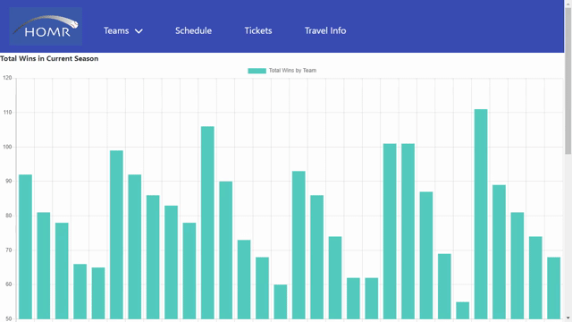
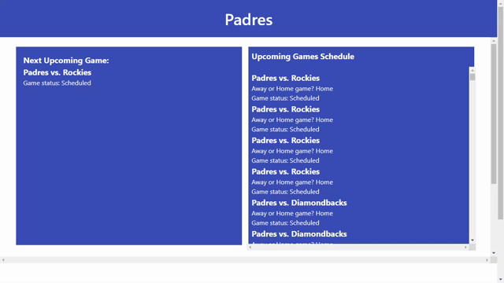

# HOMR

## Description

HOMR is an application that allows the user to view current wins and losses of the MLB season. As well as viewing home game events of the season and a travel time approximation to get to the venue. This app runs in any browser and features dynamically updated HTML webpage elements
and a CSS framework (Bulma) for the styling of the webpage. As well as using open source Javascript libraries such as Chart.JS and Jquery for the generation of content and using server-side apis to fetch the needed data.

Here is the link to the [deployed application](https://shwethareddy0.github.io/homr/)

## Why?

We wanted to create an easier way for baseball fans to see how their teams are doing for the season as well as being able to check when the next game would be for thier team.

### Learning Objectives

1.Gain a better understanding and usage on Bulma a CSS framework library to style the page into a moblie screen focused application.

2.Learn more about how to use api calls to fetch a response and parse through the response for the necessary information to incorperate into our web application.

3.Learn how to incorprate and use Chart.JS a third party javascript library to help visualize data that renders onto the webpage.

4. Learn more about dynamic generation and appending to the webpage as well as how to build and link two HTML pages together.

### Features

- Fully Responsive
- Easy to modify
- Supports HTML5, CSS3 & JavaScript

## User Stories

- As a user, I want to search for games of my favorite team so that I can see their upcoming games
  

```
function mlbSchedule(seasonYear) {
    var apiURL = 'https://api.sportsdata.io/v3/mlb/scores/json/Games/' + seasonYear + '?key=' + config.mlbKey;

    // console.log(apiURL);
    fetch(apiURL).then(response => {
        if (response.ok) {
            response.json().then(data => {
                var scheduleInfo = [];
                data.forEach(game => {
                    if (game.Status === 'Scheduled' || game.Status === 'Postponed') {
                        // console.log(game.DateTime);
                        scheduleInfo.push({
                            gameStatus: game.Status,
                            gameDay: game.DateTime,
                            gameTime: game.DateTime,
                            awayTeam: game.AwayTeam,
                            homeTeam: game.HomeTeam,
                            channel: game.Channel,
                            gameID: game.GameID
                        })
                    }
                })

                // access scheduleInfo here to build dynamic html
                // console.log(scheduleInfo);
                localStorage.setItem('mlbSchedule', JSON.stringify(scheduleInfo));
            })
        }
    })
        .catch(error => {
            console.log('unable to connect to api link')
        })
}

mlbSchedule('2023');
```

- As a user, I want to be able to see the stats for the team that I root for on the front page
  

- As a user, I want a dropdown menu to select my favorite team
  

- As a user, I want to see the games’ ticket prices with a link to where I can buy them
  

## Description of CSS framework used (links to Docs)

## BULMA

Bulma is a free, open source CSS library that provides ready-to-use frontend components that you can easily combine to build responsive web interfaces.

This means it provides CSS classes to help you style your HTML code.
[Docs](https://bulma.io/documentation/)

## Gif of site at different screen sizes

Mobile version of the app


Desktop version of the app


Wide Screen version of the app


Following is a code snippet using BULMA css framework in the application.

The navbar-brand class usually contains the logo and optionally some links or icon.
Here it is used for the HOMR logo.

```html5

 <div class="navbar-brand">
          <a class="navbar-item">
            
          </a>
        </div>
```

## Table of Contents

- [Installation](#installation)
- [Usage](#usage)
- [Technologies Used](#technologies-used)
- [Collaborators](#Collaborators)
- [License](#license)

## Installation

- Create a new repository on your GitHub account.
- Clone this repository to modify the files and images as required.
- Push your changes to your GitHub repository.
- Deploy to your preferred hosting service.

## Usage

This project can be used in any web browser or on any devices including mobile devices.

The following image is the demo screenshot of the deployed application.


## Technologies Used

- HTML5
- CSS3
- JavaScript
- jQuery
- BULMA
- Server Side APIs
- TicketMaster, SportsIO, TravelTime apis
- Chart.js

## Collaborators

- Angel Cervantes, GitHub[https://github.com/Angellyn218]
- Allen Klein, GitHub[https://github.com/allen-ek/]
- Daryl Empleo, GitHub[https://github.com/Dempleon]
- Swetha Pothuganti, GitHub[https://github.com/shwethareddy0]

## License

This project is licensed under the [MIT](./LICENSE) license.
